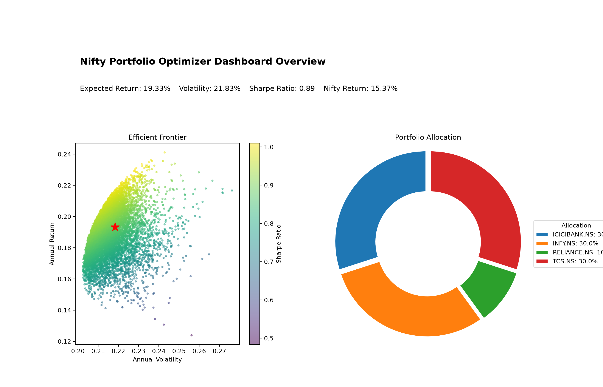
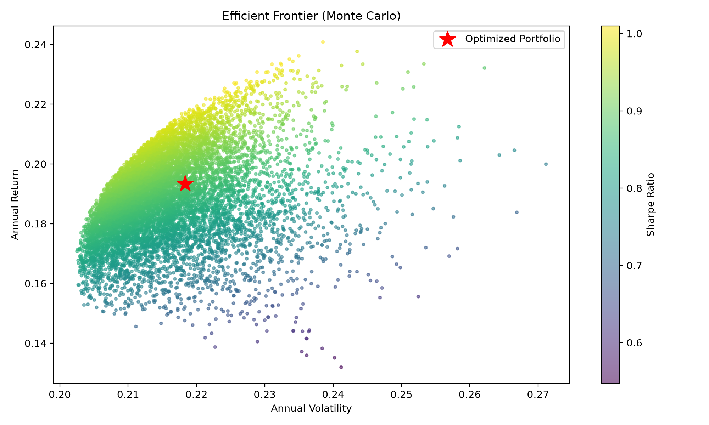
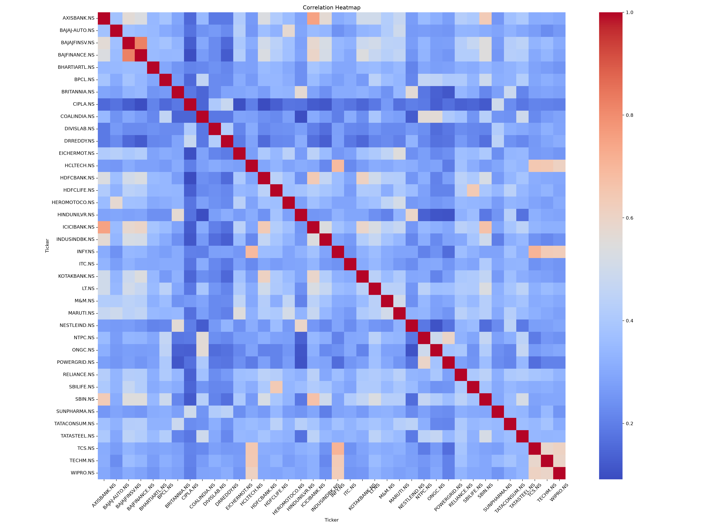
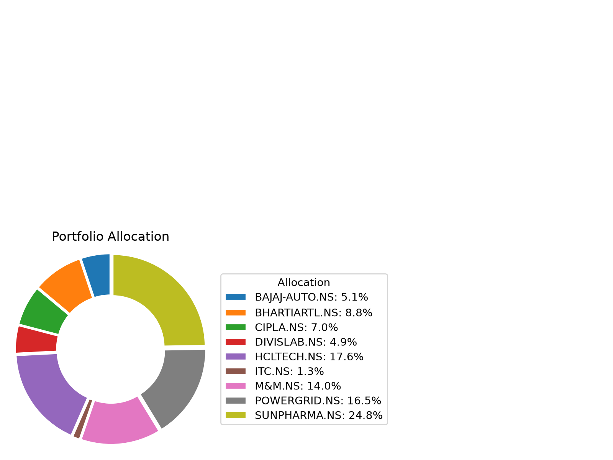

# Nifty Portfolio Optimizer

A Python application that applies **Modern Portfolio Theory** to a basket of Indian large-cap (Nifty 50) stocks. It downloads historical price data, computes risk-return metrics, optimizes portfolio weights for maximum Sharpe ratio, simulates 10,000 random portfolios to approximate the efficient frontier, and benchmarks the result against the Nifty 50 index — all surfaced through an interactive Streamlit dashboard.

---

## The Problem It Solves

Given a set of stocks, how should an investor allocate capital across them to get the best possible return for the amount of risk taken? This is the classic **portfolio construction problem**. Picking stocks individually ignores the correlation between them — two high-return stocks that move together don't diversify your risk. This project uses **Markowitz Mean-Variance Optimization** to find the mathematically optimal weight for each stock.

---

## Core Concepts

### Sharpe Ratio
The central metric the optimizer maximizes:

```
Sharpe Ratio = (Portfolio Return - Risk-Free Rate) / Portfolio Volatility
```

A higher Sharpe ratio means more return per unit of risk. Maximizing it finds the portfolio on the **Capital Market Line** — the theoretically ideal risk-return trade-off.

### Efficient Frontier
Every possible portfolio of these stocks maps to a point in (volatility, return) space. The **efficient frontier** is the upper-left boundary of that cloud — no portfolio above it exists, and any portfolio below it is suboptimal because you can get the same return with less risk (or more return for the same risk). The optimizer finds the single point on this frontier with the highest Sharpe ratio.

### Monte Carlo Simulation
To visualize the frontier, the app generates 10,000 portfolios with random weight vectors (sampled uniformly, then normalized to sum to 1). Each portfolio's annualized return and volatility is computed and plotted, colored by Sharpe ratio. The red star marks the mathematically optimized portfolio — it should sit at the top of the Sharpe color gradient.

### Why Annualize?
Daily returns and volatilities are scaled to annual figures:
- Return × 252 (trading days in a year)
- Volatility × √252 (volatility scales with square root of time)

This makes the numbers comparable to real-world benchmarks like fixed deposit rates or index returns.

---

## Stock Universe

The app exposes the full **Nifty 50** across 14 sectors. Users can build any basket from this universe using the sidebar:

| Sector | Stocks |
|---|---|
| IT | TCS, INFY, HCLTECH, WIPRO, TECHM |
| Banking | HDFCBANK, ICICIBANK, SBIN, KOTAKBANK, AXISBANK, INDUSINDBK |
| Financial Services | BAJFINANCE, BAJAJFINSV, HDFCLIFE, SBILIFE |
| Energy | RELIANCE, ONGC, BPCL, NTPC, POWERGRID, COALINDIA |
| FMCG | HINDUNILVR, ITC, NESTLEIND, BRITANNIA, TATACONSUM |
| Pharma | SUNPHARMA, DRREDDY, CIPLA, DIVISLAB |
| Auto | MARUTI, TATAMOTORS, BAJAJ-AUTO, HEROMOTOCO, EICHERMOT, M&M |
| Metals & Mining | TATASTEEL, JSWSTEEL, HINDALCO |
| Cement | ULTRACEMCO, SHREECEM, GRASIM |
| Conglomerate / Infra | LT, ADANIPORTS, ADANIENT |
| Telecom | BHARTIARTL |
| Consumer | ASIANPAINT, TITAN |
| Healthcare | APOLLOHOSP |
| Agro / Chemicals | UPL |

The **default basket** is a curated 15-stock cross-sector selection that loads on first run. The benchmark is the **Nifty 50 index** (`^NSEI`).

---

## Architecture

The entire application lives in a single file (`app.py`), structured as a pipeline of pure functions:

```
download_prices()
    └─> calculate_returns()
            └─> optimize_portfolio()          [PyPortfolioOpt]
            └─> simulate_portfolios()         [Monte Carlo]
            └─> compare_with_nifty()          [Benchmarking]
                    └─> render_dashboard()    [Streamlit, if running in browser]
                    └─> save_plot()           [Matplotlib, always]
```

The `main()` entry point calls `running_in_streamlit()` to detect its execution context and branches accordingly — the same `run_pipeline()` function powers both CLI and dashboard modes.

---

## Tech Stack

| Library | Role | Why This Choice |
|---|---|---|
| `yfinance` | Market data download | Free, no API key required, covers NSE tickers with `.NS` suffix |
| `PyPortfolioOpt` | Mean-variance optimization | Handles covariance shrinkage, constraints, and frontier math cleanly |
| `pandas` | Data wrangling | Natural fit for time-series price and return data |
| `numpy` | Vectorized math | Used directly for Monte Carlo weight sampling and portfolio math |
| `matplotlib` / `seaborn` | Static plots | Saved as PNGs for README and offline use |
| `streamlit` | Interactive dashboard | Zero-boilerplate Python-native UI for data apps |

---

## How the Optimization Works (Step by Step)

### 1. Download and clean data
`yfinance.download()` fetches OHLCV data; only the `Close` column is kept. Rows where all stocks have missing data are dropped.

### 2. Compute expected returns
```python
mu = expected_returns.mean_historical_return(price_data)
```
`PyPortfolioOpt` computes the annualized mean return for each stock from historical daily returns.

### 3. Build the covariance matrix (Ledoit-Wolf shrinkage)
```python
covariance = risk_models.CovarianceShrinkage(price_data).ledoit_wolf()
```
With a large number of assets, the **sample covariance matrix** becomes numerically unstable — small estimation errors get amplified, leading the optimizer to take extreme positions. **Ledoit-Wolf shrinkage** regularizes the matrix by pulling extreme correlations toward zero, producing a more robust estimate. This is standard practice in institutional portfolio construction.

### 4. Solve the optimization
```python
frontier = EfficientFrontier(mu, covariance)
frontier.add_constraint(lambda w: w <= max_weight)  # 30% cap per stock
frontier.max_sharpe()
```
Under the hood, `EfficientFrontier.max_sharpe()` transforms the problem into a **convex quadratic program** and solves it using CVXPY. The 30% weight cap prevents over-concentration and forces diversification.

### 5. Clean weights
```python
cleaned_weights = frontier.clean_weights()
```
Weights below a numerical threshold (~1e-4) are set to zero and the rest are renormalized. This eliminates noise from the optimizer.

---

## Constraint Design

The `max_weight=0.30` constraint is intentional. Without it, the optimizer might put 100% in the single highest Sharpe stock — which is mathematically valid but practically useless. The cap forces the optimizer to find the best *diversified* portfolio, which is closer to what a real fund manager would construct.

---

## Benchmarking

The optimized basket's **realized annualized return** (computed from actual daily returns, not the optimizer's forward-looking estimate) is compared to the Nifty 50's return over the same period. This tests whether the optimized weights, applied historically, would have beaten the index.

```python
basket_return = (daily_returns @ weight_series).mean() * 252
nifty_return  = nifty_close.pct_change().dropna().mean() * 252
```

---

## Interactive Dashboard

Run with Streamlit to get a live dashboard with sidebar controls:

- **Stock selection** — choose which subset of the basket to include
- **Date range** — adjust the historical window
- **Max weight cap** — tighten or loosen the concentration constraint
- **Monte Carlo count** — trade off simulation quality vs. speed

All charts and metrics recompute on every control change.

---

## Project Structure

```
nifty-portfolio-optimizer/
├── app.py               # entire application — pipeline + dashboard
├── requirements.txt
├── data/
│   └── nifty_close_prices.csv   # generated on first run
├── plots/
│   ├── efficient_frontier.png
│   ├── correlation_heatmap.png
│   ├── portfolio_allocation.png
│   └── dashboard_overview.png
└── README.md
```

---

## Setup

```bash
git clone https://github.com/Vikas9892/nifty-portfolio-optimizer.git
cd nifty-portfolio-optimizer
python -m venv .venv
.venv\Scripts\activate          # Windows
# source .venv/bin/activate     # macOS / Linux
pip install -r requirements.txt
```

## Running the App

```bash
# CLI — downloads data, optimizes, saves plots to plots/
python app.py

# Interactive Streamlit dashboard
streamlit run app.py
```

---

## Output Preview

### Dashboard Overview


### Efficient Frontier (Monte Carlo)


### Correlation Heatmap


### Portfolio Allocation


---

## Limitations and Honest Trade-offs

- **Backward-looking:** Mean-variance optimization uses historical returns as a proxy for expected future returns. Past performance is not predictive.
- **Normal distribution assumption:** The covariance model assumes returns are normally distributed. Equity returns have fat tails, so extreme events are underweighted.
- **Small basket:** Five stocks is too few for real diversification. The project intentionally keeps this small for clarity.
- **No transaction costs or taxes:** The benchmark comparison ignores slippage, brokerage, and STT — which would reduce the basket's real-world edge.
- **Single-period model:** Mean-variance is a single-period framework. It doesn't account for rebalancing over time.

These are the right trade-offs for a self-contained learning project — the goal is to demonstrate the full optimization workflow, not to build a production trading system.

---

## Key Results (2020–2025 backtest)

Running the pipeline on the default basket produces weights that are concentrated in whichever stocks had the best historical Sharpe contribution. The correlation heatmap typically shows high correlation between TCS and INFY (both IT services), which the optimizer accounts for by not over-allocating to both simultaneously.
