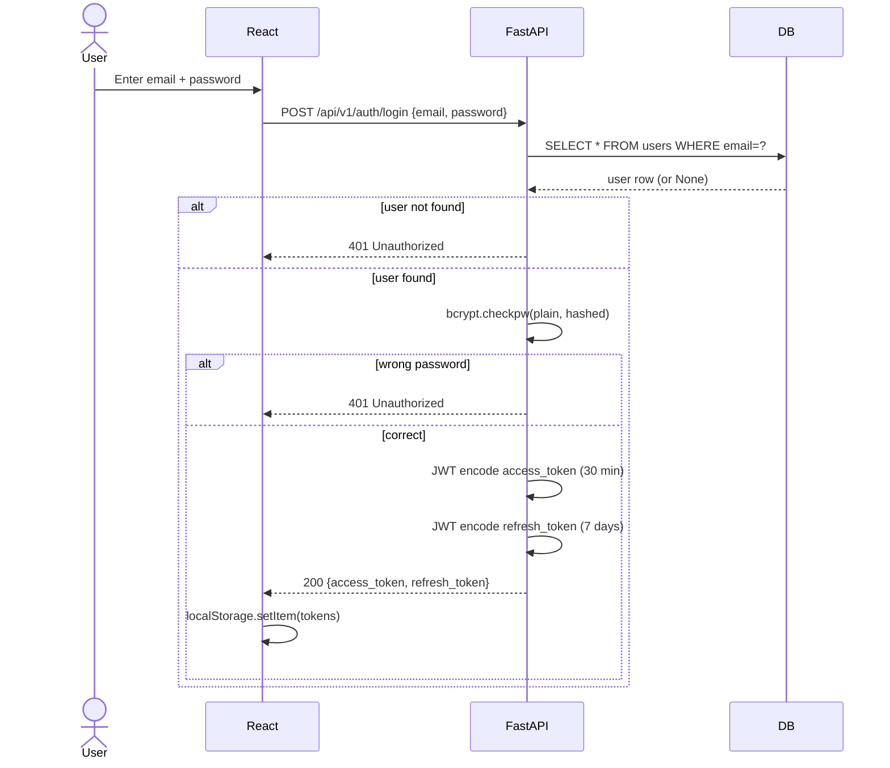
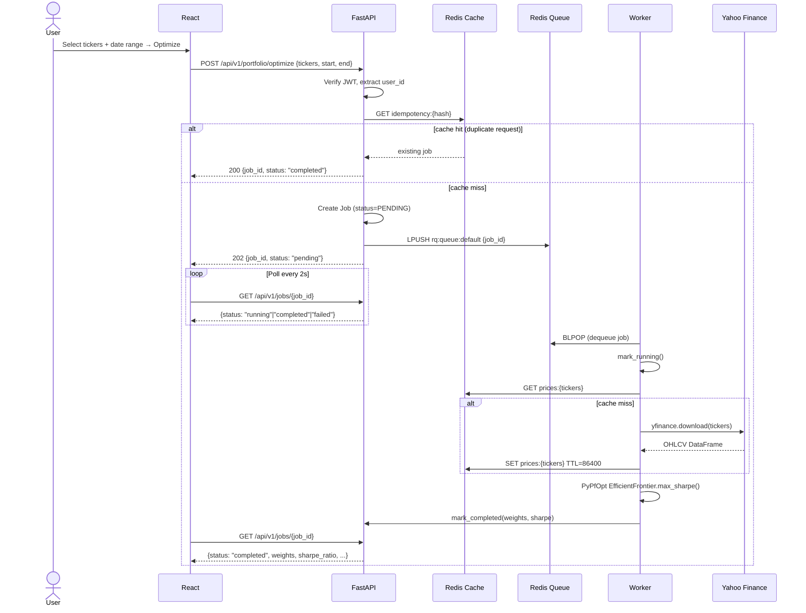
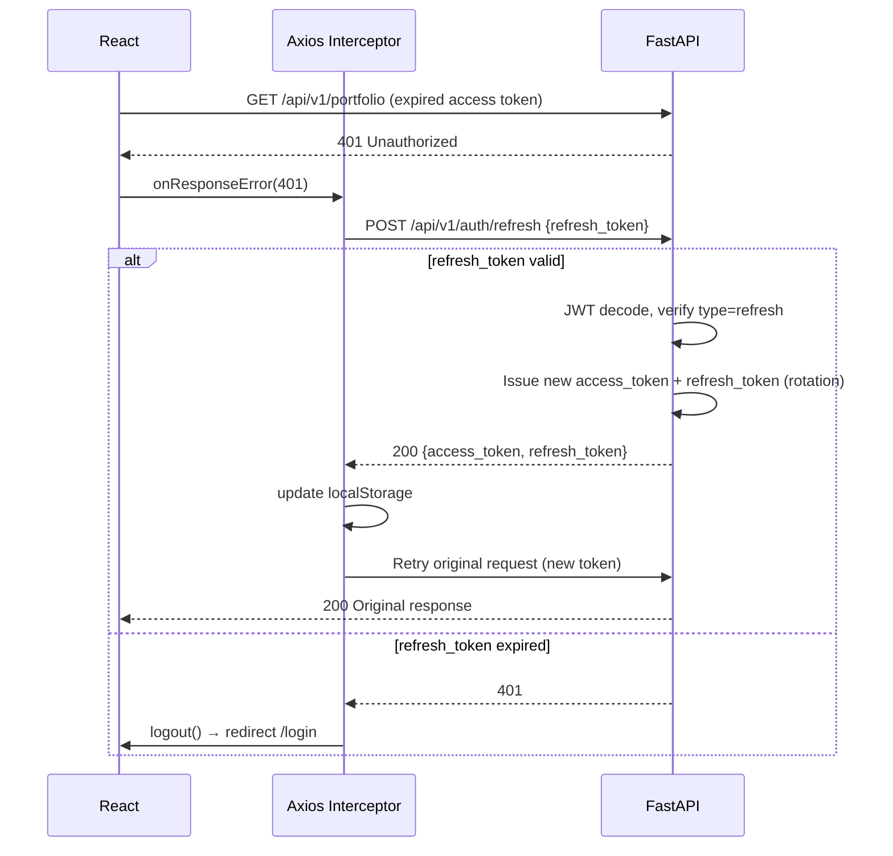
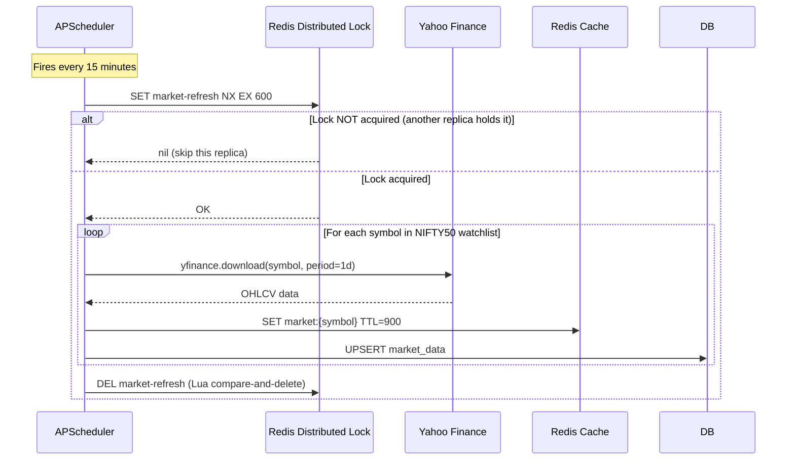
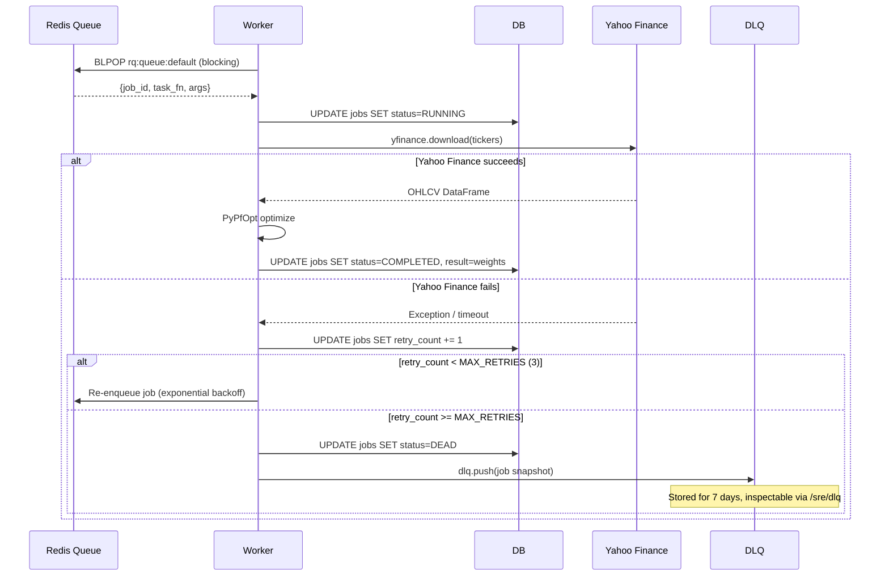
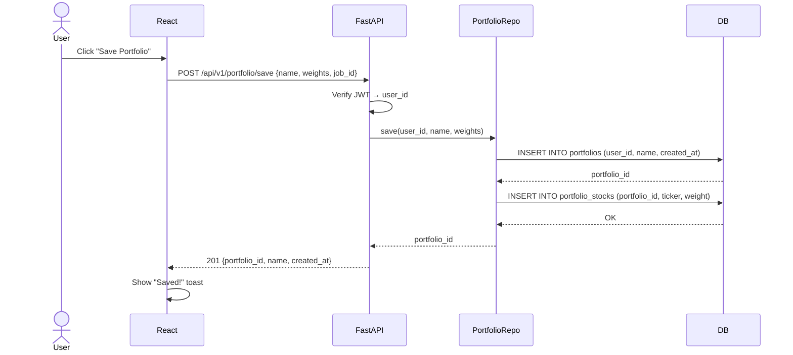
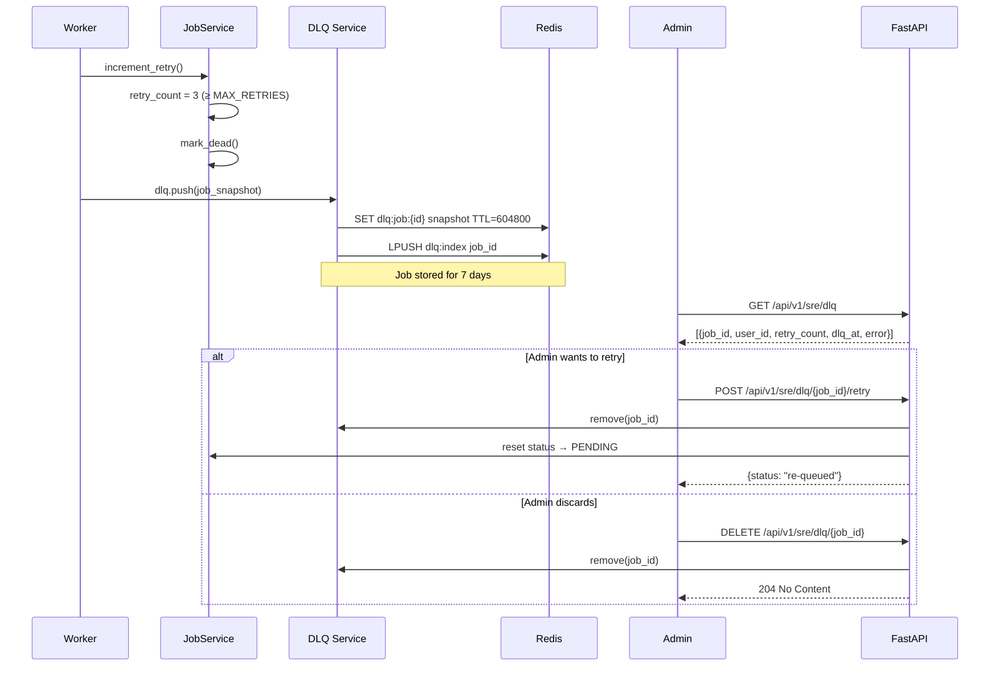
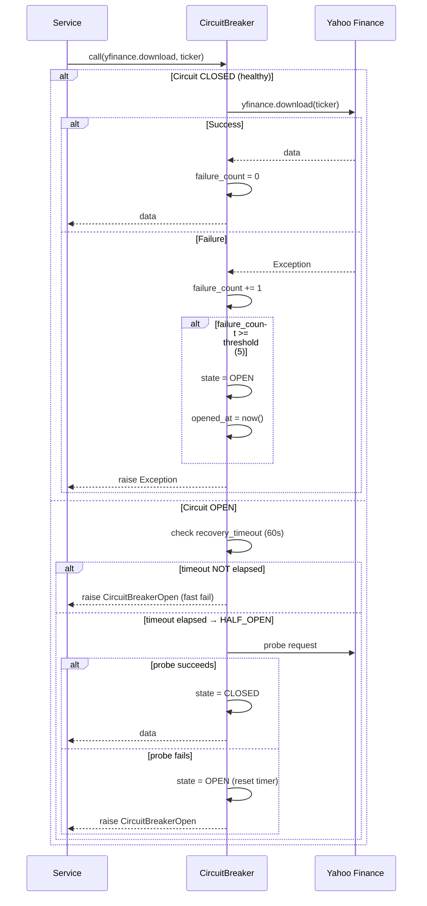

# System Design — Nifty Portfolio Optimizer

> Version: 4.0.0 · Last updated: 2026-07-02

---

## Table of Contents

1. [High-Level Architecture](#1-high-level-architecture)
2. [Component Map](#2-component-map)
3. [Request Flow — Portfolio Optimize](#3-request-flow--portfolio-optimize)
4. [Authentication Flow](#4-authentication-flow)
5. [Refresh Token Flow](#5-refresh-token-flow)
6. [Background Job Flow](#6-background-job-flow)
7. [Scheduler Flow](#7-scheduler-flow)
8. [Sequence Diagrams](#8-sequence-diagrams)
   - [8.1 Login](#81-login-sequence)
   - [8.2 Optimize](#82-optimize-sequence)
   - [8.3 Refresh Token](#83-refresh-token-sequence)
   - [8.4 Scheduler](#84-scheduler-sequence)
   - [8.5 Background Worker](#85-background-worker-sequence)
   - [8.6 Portfolio Save](#86-portfolio-save-sequence)
   - [8.7 Dead Letter Queue](#87-dead-letter-queue-sequence)
   - [8.8 Retry / Circuit Breaker](#88-retry--circuit-breaker-sequence)

---

## 1. High-Level Architecture

```
                         ┌─────────────────────────────────────────────────────┐
                         │                  PRODUCTION STACK                   │
                         └─────────────────────────────────────────────────────┘

 ┌──────────┐    HTTPS    ┌──────────────┐   HTTP/1.1   ┌──────────────────────┐
 │  Browser │────────────▶│  Nginx/LB    │─────────────▶│   React SPA (Vite)   │
 │  Mobile  │            │  (Port 80/443)│              │   Port 3000           │
 └──────────┘            └──────────────┘               └──────────────────────┘
       │                        │                                  │
       │                        │ /api/*  reverse proxy            │  XHR/Fetch
       │                        ▼                                  │
       │               ┌─────────────────┐                         │
       └───────────────│  FastAPI (ASGI)  │◀────────────────────────┘
                       │  Uvicorn workers│
                       │  Port 8000       │
                       └────────┬────────┘
                                │
              ┌─────────────────┼──────────────────┐
              │                 │                  │
              ▼                 ▼                  ▼
   ┌──────────────────┐ ┌────────────┐  ┌─────────────────┐
   │  Auth Service    │ │  Portfolio │  │  Market Service  │
   │  - bcrypt hash   │ │  Optimizer │  │  - Yahoo Finance │
   │  - JWT sign/vfy  │ │  - PyPfOpt │  │  - Circuit Bkr  │
   └──────────────────┘ └────────────┘  └─────────────────┘
              │                 │                  │
              └────────────┬────┘                  │
                           ▼                       │
              ┌─────────────────────────────────┐  │
              │       Repository Layer          │  │
              │  UserRepo / PortfolioRepo /     │  │
              │  JobRepo  / MarketDataRepo      │  │
              └────────────┬────────────────────┘  │
                           │                       │
              ┌────────────┼────────────┐          │
              ▼            ▼            ▼          ▼
    ┌─────────────┐ ┌──────────┐ ┌──────────────────┐
    │ PostgreSQL  │ │  SQLite  │ │  Redis           │
    │ (prod)      │ │ (dev)    │ │  - Job Queue     │
    │ Port 5432   │ │          │ │  - Cache (24h)   │
    └─────────────┘ └──────────┘ │  - Feature Flags │
                                 │  - DLQ           │
                                 │  - Dist Lock     │
                                 └────────┬─────────┘
                                          │ RQ workers
                                          ▼
                          ┌───────────────────────────┐
                          │  Background Worker (RQ)   │
                          │  - portfolio_optimize_task│
                          │  - market_refresh_task    │
                          └───────────────────────────┘
                                          │ yfinance
                                          ▼
                               ┌──────────────────┐
                               │  Yahoo Finance   │
                               │  (External API)  │
                               └──────────────────┘

  Observability stack:
  ┌────────────────┐  ┌─────────────┐  ┌──────────────┐  ┌─────────────┐
  │  Prometheus    │  │  Grafana    │  │ Alertmanager │  │  JSON Logs  │
  │  /metrics      │─▶│  Dashboards │  │  Email/Slack │  │  (stdout)   │
  └────────────────┘  └─────────────┘  └──────────────┘  └─────────────┘
```

---

## 2. Component Map

| Layer | Technology | Responsibility |
|---|---|---|
| Reverse Proxy | Nginx | TLS termination, static file serving, upstream proxy |
| Frontend | React 18 + Vite + TypeScript | SPA — auth, portfolio UI, charts |
| API Gateway | FastAPI 0.111 + Uvicorn | HTTP routing, middleware, OpenAPI |
| Auth | python-jose + bcrypt | JWT access/refresh tokens, password hashing |
| Services | Pure Python classes | Business logic, validation, orchestration |
| Repositories | SQLAlchemy Core | Database I/O, query building, no ORM overhead |
| Cache | Redis (via redis-py) | Cache-aside for market data; TTL = 24h |
| Queue | Redis + RQ | Async job queue; workers pull from `default` queue |
| Database | PostgreSQL (prod) / SQLite (dev) | Persistent state |
| Scheduler | APScheduler | Periodic market refresh every 15 min |
| Observability | Prometheus + Grafana | Metrics, dashboards, alert rules |

---

## 3. Request Flow — Portfolio Optimize

```
User Browser
    │
    │ POST /api/v1/portfolio/optimize
    │ Header: Authorization: Bearer <access_token>
    │
    ▼
Nginx (port 443)
    │
    │ proxy_pass http://backend:8000
    │
    ▼
FastAPI — ASGI event loop
    │
    ├─ 1. CorrelationID Middleware
    │      generates X-Request-ID: uuid4, attaches to request state
    │
    ├─ 2. Auth Middleware / Depends(get_current_user)
    │      decodes JWT, loads user_id from sub claim
    │      raises 401 if expired or invalid
    │
    ├─ 3. Request Router → portfolio_router.optimize()
    │
    ├─ 4. Idempotency check
    │      key = hash(user_id + tickers + start + end)
    │      if cache.get(key) → return existing job immediately
    │
    ├─ 5. Create Job record in DB (status=PENDING)
    │
    ├─ 6. Enqueue RQ task  ──────────────────────────────────────┐
    │      rq.enqueue(portfolio_optimize_task, job_id)            │
    │                                                             │
    ├─ 7. Return 202 Accepted { job_id, status: "pending" }      │
    │                                                             │
    ▼                                                             ▼
Client polls GET /api/v1/jobs/{job_id}            RQ Worker Process
                                                       │
                                                       ├─ 1. Load job from DB
                                                       ├─ 2. mark_running()
                                                       ├─ 3. Check cache for prices
                                                       │      if miss → yfinance.download()
                                                       │      if yahoo down → CircuitBreaker opens
                                                       ├─ 4. Run PyPfOpt (EfficientFrontier)
                                                       ├─ 5. Store weights in DB
                                                       ├─ 6. mark_completed()
                                                       └─ 7. Cache result (TTL=300s)

Client polling response:
  PENDING → RUNNING → COMPLETED → weights, sharpe, return, volatility
```

---

## 4. Authentication Flow

```
                    ┌─────────┐         ┌──────────┐        ┌──────────┐
                    │  React  │         │  FastAPI │        │    DB    │
                    └────┬────┘         └────┬─────┘        └────┬─────┘
                         │                   │                    │
  POST /auth/register    │                   │                    │
  { name, email, pw }   │──────────────────▶│                    │
                         │                   │                    │
                         │        validate Pydantic schema        │
                         │                   │                    │
                         │        bcrypt.hashpw(pw, rounds=12)    │
                         │                   │                    │
                         │                   │ INSERT INTO users  │
                         │                   │──────────────────▶│
                         │                   │                    │
                         │  201 { message }  │                    │
                         │◀──────────────────│                    │
                         │                   │                    │
  POST /auth/login       │                   │                    │
  { email, password }    │──────────────────▶│                    │
                         │                   │ SELECT user        │
                         │                   │──────────────────▶│
                         │                   │◀──────────────────│
                         │                   │                    │
                         │        bcrypt.checkpw(pw, hash)        │
                         │        if wrong → 401                  │
                         │                   │                    │
                         │        JWT encode { sub: user_id,      │
                         │                    type: "access",     │
                         │                    exp: now+30min }    │
                         │        JWT encode { sub: user_id,      │
                         │                    type: "refresh",    │
                         │                    exp: now+7days }    │
                         │                   │                    │
                         │  200 { access_token, refresh_token,   │
                         │         expires_in: 1800 }             │
                         │◀──────────────────│                    │
                         │                   │                    │
  Subsequent requests:   │                   │                    │
  Authorization: Bearer <access_token>       │                    │
                         │──────────────────▶│                    │
                         │         JWT.decode() → user_id         │
                         │         Depends(get_current_user)      │
                         │◀──────────────────│                    │
```

---

## 5. Refresh Token Flow

```
  ┌─────────┐                    ┌──────────┐
  │  React  │                    │  FastAPI │
  └────┬────┘                    └────┬─────┘
       │                              │
       │  access_token expires (401)  │
       │◀─────────────────────────────│
       │                              │
       │  POST /auth/refresh          │
       │  { refresh_token }           │
       │─────────────────────────────▶│
       │                              │
       │              JWT.decode(refresh_token)
       │              assert type == "refresh"
       │              assert not expired (7 days)
       │                              │
       │              Issue new access_token (30 min)
       │              Issue new refresh_token (7 days)   ← token rotation
       │                              │
       │  200 { access_token,         │
       │         refresh_token }      │
       │◀─────────────────────────────│
       │                              │
       │  Retry original request      │
       │─────────────────────────────▶│
```

*Token rotation prevents refresh token theft: each refresh issues a new pair. Stolen old refresh tokens become invalid after the first use.*

---

## 6. Background Job Flow

```
  FastAPI handler                 Redis (RQ Queue)              RQ Worker
       │                               │                            │
       │ rq.enqueue(task, job_id) ────▶│                            │
       │                               │  LPUSH rq:queue:default    │
       │ return 202 { job_id }         │                            │
       │                               │ BLPOP (blocking pop)  ────▶│
       │                               │                            │
       │                               │                 Load job from DB
       │                               │                 mark_running()
       │                               │                            │
       │                               │              yfinance.download()
       │                               │              [Circuit breaker guards]
       │                               │                            │
       │                               │              PyPfOpt optimize
       │                               │                            │
       │                               │              save weights to DB
       │                               │              mark_completed()
       │                               │                            │
  GET /jobs/{id} ─────────────────────────────────────────────────▶│
  polling                             │              { status, weights, sharpe }
       │◀───────────────────────────────────────────────────────────│

  Failure path:
       │                               │                            │
       │                               │              job fails → increment_retry()
       │                               │              if retry < 3 → re-enqueue
       │                               │              if retry ≥ 3 → mark_dead()
       │                               │                          → dlq.push(job)
       │                               │                            │
  GET /api/v1/sre/dlq                 │              DLQ stores snapshot
  (admin endpoint)                    │              7-day TTL
```

---

## 7. Scheduler Flow

```
  APScheduler (main process)        Redis (Distributed Lock)      DB + Yahoo
       │                                    │                          │
       │  Every 15 minutes:                 │                          │
       │                                    │                          │
       │  acquire_lock("market-refresh",    │                          │
       │               ttl=600)             │                          │
       │───────────────────────────────────▶│                          │
       │              SET market-refresh NX EX 600                    │
       │                                    │                          │
       │  if NOT acquired (another          │                          │
       │  replica holds lock) → skip        │                          │
       │                                    │                          │
       │  if acquired:                      │                          │
       │    for each symbol in NIFTY50:    │                          │
       │      yfinance.download(symbol)    │───────────────────────────▶
       │      cache.set(symbol, data)      │                          │
       │      save to market_data table    │                          │
       │    end for                        │                          │
       │                                   │                          │
       │  release_lock() ─────────────────▶│                          │
       │              DEL market-refresh (Lua compare-and-delete)     │
       │                                   │                          │

  Why distributed lock:
  In a multi-replica deployment (3x FastAPI pods), all schedulers
  fire at the same minute. Without the lock, all 3 pods would hit
  Yahoo Finance simultaneously for all 50 symbols → 150 API calls
  instead of 50. The lock ensures exactly one pod runs the refresh.
```

---

## 8. Sequence Diagrams

### 8.1 Login Sequence



### 8.2 Optimize Sequence



### 8.3 Refresh Token Sequence



### 8.4 Scheduler Sequence



### 8.5 Background Worker Sequence



### 8.6 Portfolio Save Sequence



### 8.7 Dead Letter Queue Sequence



### 8.8 Retry / Circuit Breaker Sequence



---

## Architecture Principles

| Principle | How it's applied |
|---|---|
| **Separation of concerns** | Router → Service → Repository → DB; no business logic in routes |
| **Fail fast** | Circuit breaker on Yahoo Finance; 60s recovery timeout |
| **Async by default** | RQ offloads CPU-bound optimization to workers; API stays <50ms |
| **Idempotency** | Cache-keyed by request hash; duplicate calls return same job |
| **Observability first** | Every request tagged with correlation ID; JSON logs; Prometheus metrics |
| **Defense in depth** | JWT auth + bcrypt + rate limiting + input validation (Pydantic) |
| **Graceful degradation** | Feature flags allow disabling workers/cache without restart |
